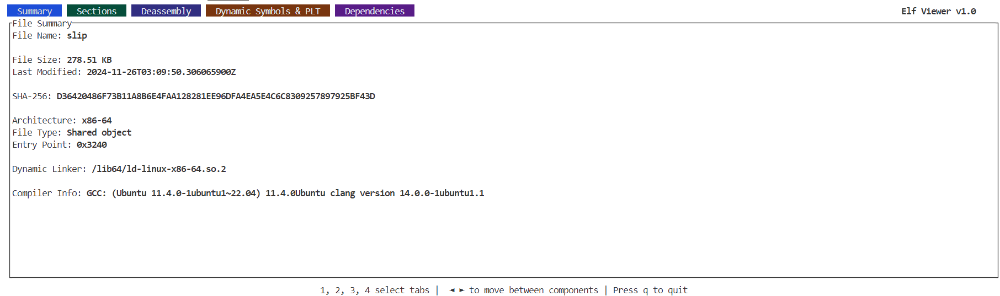

ExeViewer
=========

ExeViewer is a simple commandline tool to view the contents of an executable file.
It's written in rust and uses the `elf` crate to parse the executable file.

## Features

- View the section headers of the executable file.
- Disassemble the text section of the executable file.
- View Dynamic Symbols and PLT table
- Currently only supports ELF files and x86_64 architecture.
  



## Installation

You can install the tool by running the following command (you need to have `cargo` and `rust` installed on your system):

```bash
cargo install --git https://github.com/sunxfancy/ExeViewer
```


## Build

To build the project, you need to have `rust` installed on your system. You can install it from [here](https://www.rust-lang.org/tools/install).

After installing `rust`, you can build the project by running the following command:

```bash
cargo build --release
```

This will create the executable in the `target/release` directory.

## Usage

To view the contents of an executable file, you can run the following command:

```bash
exe_viewer <path-to-executable>
```


## License

MIT License (c) 2024 sunxfancy
